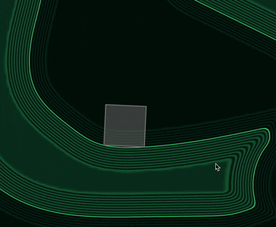

# English Description
This is an experiment in integrating SDF (signed distance field) into Box2D 3.1.1 (tagged release). The collisions work quite well. Using polygons as an example: they do not fall through the ground; they can be stacked into a stable tower; they slide if friction is low, or tumble if friction is high; bodies go to sleep. The functionality that requires calculating the distance between shapes does not work: OverlapShape, CastShape, continuous collision, sensors, and who knows what else. Examples have been added to the demo application. I recommend cloning the repository, building the demo application, and reading the comments in the added code.
# Описание на русском
Это эксперимент по интегрированию SDF (signed distance field) в Box2D 3.1.1 (тегированный релиз). Коллизии работают неплохо. На примере полигонов: они не проваливаются в землю; их можно сложить в стабильную башенку; они скользят, если трение низкое, или кувыркаются, если трение высокое; тела уходят в сон. Не работает функционал, которому нужно вычислять расстояние между шейпами: OverlapShape, CastShape, continuous collision, сенсоры и бог знает, что ещё. В демо-приложение добавлены примеры. Рекомендую клонировать репозиторий, собрать демо-приложение, почитать комментарии в добавленном коде. 
# Some GIFs

# TODO
- v3 uses speculative collision, so the separation can be up to b2_speculativeDistance
- Test with circle collider: 1) Get the normal at the circle's center 2) Add to the circle's center the normal vector multiplied by the circle's radius 3) Sample the SDF at the obtained position 4) Compare with zero
