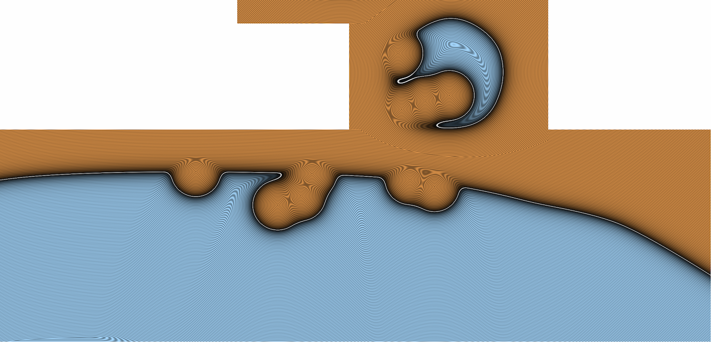

https://telegra.ph/SDF-From-Graphics-to-Physics-06-07

This is an experiment in integrating SDF (signed distance field) into Box2D 3.1.1 (tagged release). The collisions work quite well. Using polygons as an example: they do not fall through the ground; they can be stacked into a stable tower; they slide if friction is low, or tumble if friction is high; bodies go to sleep. The functionality that requires calculating the distance between shapes does not work: OverlapShape, CastShape, continuous collision, sensors, and who knows what else. Examples have been added to the demo application. I recommend cloning the repository, building the demo application, and reading the comments in the added code (in GitHub Desktop, for example, select all commits from 'SDF terrain shape' to the most recent to see the combined changes).
# Some GIFs

# Bonus
The SDF.h file contains functions I use in my game. It requires the GLM library and at least C++20. The ParseSVG.js file contains a standalone JavaScript script for parsing an SVG file into a format compatible with SDF::svg. The file ground.svg is an example of what my SVG files look like
### What it looks like in-game

# TODO
- Shape cast of circle (circle cast) vs. exact SDF is simply a raycast with `d - radius`.
- Making the gradient computation a user-defined callback can be useful https://iquilezles.org/articles/distgradfunctions2d/. Also bounding boxes https://iquilezles.org/articles/bboxes2d/
- Implement kinematic SDF bodies. To do this, first ensure that the body transform is not ignored.
- also try compound shapes
- bump box2d to latest tagged release
- https://www.shadertoy.com/view/WstcW4 moving distance field (using dt on gradiant)
